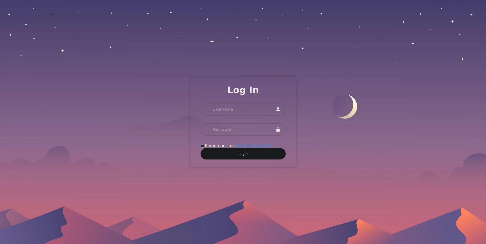

<h1>Frontend Login Window Design</h1>

  
This repository contains a frontend login window design implemented using HTML and CSS.

  <h2>Features</h2>

  <ul>
    <li>Clean and modern design.</li>
    <li>User-friendly interface with intuitive login form fields.</li>
  </ul>

  <h2>Screenshots</h2>

  
Here is the screenshot of the login window design:

  

  <h2>Usage</h2>

  
Clone the repository to your local machine:

  <pre><code>git clone https://github.com/Dark-Programer/login-ui-design.git</code></pre>

  
Open the <code>index.html</code> file in your web browser to view the login window design.

  <h2>Author</h2>

  
Arka Chakraborty

